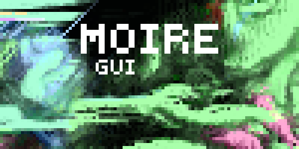

Moire: Multi-Objective Interactive Runtime Environment
======================================================

The official GUI for `Artipixoids!`_ project.

It is integrating natively with `Xentica`_ framework, but you may also
use it to visualize any step-by-step simulations.

.. _Artipixoids!: http://artipixoids.a5kin.net/concept/artipixoids_concept.pdf
.. _Xentica: https://github.com/a5kin/xentica/

.. warning::
   Current version is a work-in-progress, it works to some
   degree, but please do not expect something beneficial from it. As
   planned, really useful stuff would be available only starting from
   version 0.3.

User Guide
----------

If you brave enough to ignore the warning above, dive right into this
guide. Hopefully, you will manage to install Moire on your system
and at least run some examples.

.. toctree::
   :maxdepth: 2
	      
   manual/installation
   manual/tutorial
   
API Reference
-------------

.. toctree::
   :maxdepth: 2

   api/moire
   api/moire.widgets

Indices and tables
==================

* :ref:`genindex`
* :ref:`modindex`
* :ref:`search`
